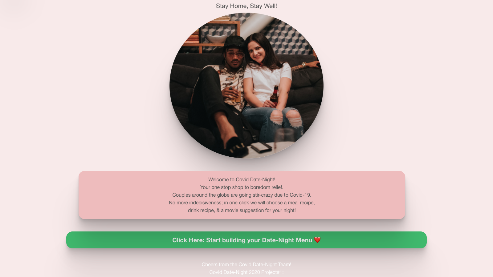
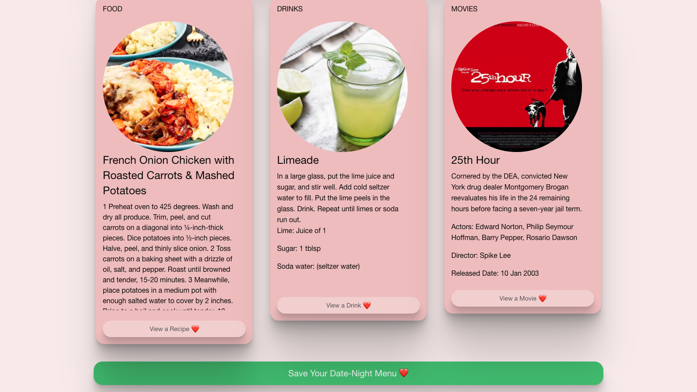

# Project-1 Title: COVID Date Night

## Description

Amidst the COVID pandemic, there are tons of couples quickly running out of ideas of what to do. We've created an app to help the user decide on an at home date night to keep from going stir-crazy while stuck at home.

It will contain three major components to create a fun date night at home. Third-party APIs are used to select top-rated movies, food recipes, and drink recipes. The user is taken to a home page where they click to begin. They can then make a selection of a food recipe, drink recipe, and movie. Once selections are made, user can then choose to save the menu to the screen for later reference.

## Link to Application

https://kmeersman624.github.io/Project-1/

## User Story

As a mindful couple staying at home during the COVID pandemic, I am looking for someone to choose what to cook, drink, and watch with my significant other.  
I would like an app to generate top rated movies and recipes so that I am able to enjoy my evening.

## Images

## Built With

- HTML
- JavaScript
- JQuery
- CSS
- Foundation (CSS Framework): https://get.foundation/
- Movie API: OMDB https://www.omdbapi.com/
- Food Recipes API: https://www.themealdb.com/api.php
- Drink Recipes API: https://www.thecocktaildb.com/api.php

## Contributing

- Skyler Bluth
- Kate Meersman
- James Nowak
- Michael Zlotkowski

## License

© 2020 SKJM brand. All Rights Reserved.
